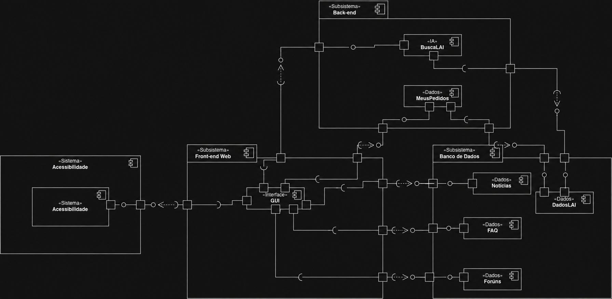
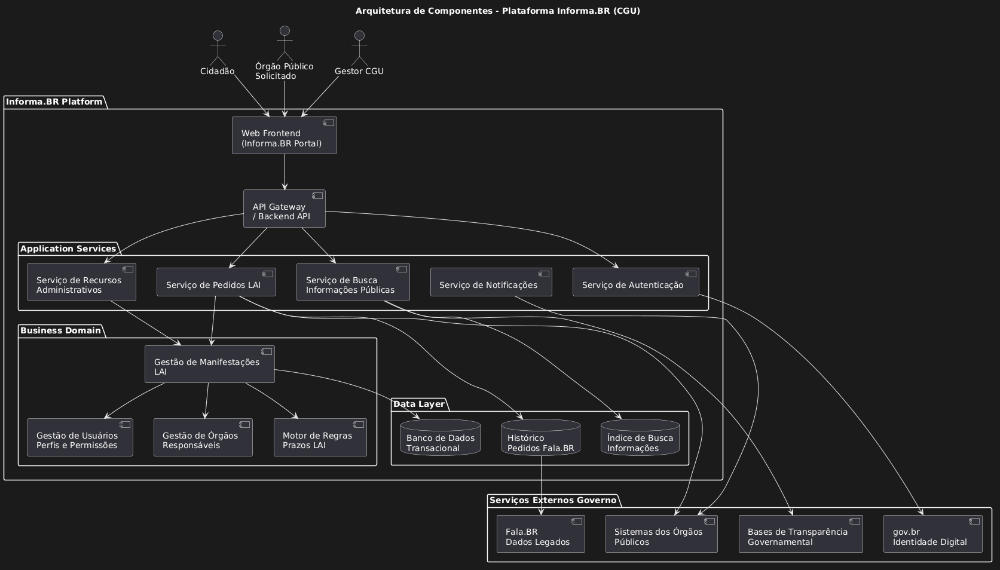
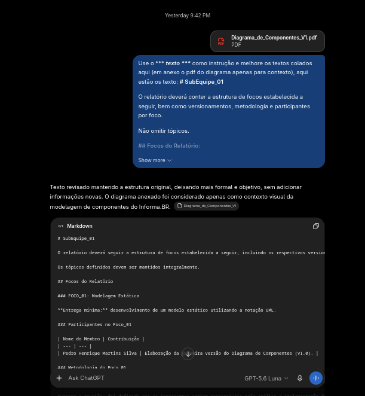

# SubEquipe_01
O relatório deverá conter a estrutura de focos estabelecida a seguir, bem como versionamentos, metodologia e participantes por foco.
Não omitir tópicos.

## Focos do Relatório:
### FOCO_01: Modelagem Estática
Entrega Mínima: um modelo estático, na notação UML.

### Participantes no Foco_01
| Nome do Membro | Contribuição |
| --- | --- |
| Pedro Henrique Martins Silva | Elaboração da modelagem do Diagrama de Componentes v1.0 (Estrutura Inicial) |
| Luiz Henrique Pallavicini | Evolução e refatoração do Diagrama de Componentes v1.1 (Ajuste das regras UML) |
| Pedro Henrique Martins Silva | Elaboração da modelagem do Diagrama de Componentes v1.2(Adequação Final) |

### Metodologia do Foco_01

Foi realizada uma reunião geral do grupo na segunda-feira, 15/09, para definir a forma de contribuição dos membros Tiago e Luiz após a elaboração da primeira versão do Diagrama de Componentes por Pedro Silva.

Durante a reunião, foi definido que os integrantes seriam responsáveis pela análise e implementação das alterações sugeridas pela professora no diagrama previamente desenvolvido. As discussões, dúvidas e atualizações relacionadas ao processo foram realizadas por meio do grupo de comunicação no WhatsApp.

[Link para Ata da Reunião](ExtrasSubEquipe_01/Ata_Reuniao_Alinhamento.md)

### Modelo Estático
Modelo estático na notação UML.
# Diagrama de Componentes

O Diagrama de Componentes foi desenvolvido considerando como sistema principal o portal **Informa.BR (informabr.cgu.gov.br)**, buscando representar seus principais componentes e relacionamentos arquiteturais.

A construção do modelo seguiu as seguintes etapas:

### Levantamento de referências e definição do fluxo representado

Inicialmente, foram analisados diagramas de componentes desenvolvidos por grupos de semestres anteriores (2026.1), com o objetivo de compreender diferentes formas de representação e definir o fluxo principal a ser modelado.

Referências utilizadas:

- [Diagrama de Componentes - Grupo 8 Finanças](https://unbarqdsw2026-1-turma02.github.io/2026.01-T02_G8_Financas_Entrega_02/#/Modelagem/2.1.ModelagemEstatica?id=diagrama-de-componentes)
- [Diagrama de Componentes - Grupo 5 Eu Amo Piri](https://unbarqdsw2026-1-turma02.github.io/2026.01-T02_G5_EuAmoPiri_Entrega_02/#/Modelagem/ModelagemEstatica/2.1.3.Diagrama_de_Componentes)

### Análise arquitetural do sistema

Foi realizada uma análise da estrutura arquitetural do Informa.BR, complementada pelo estudo de soluções semelhantes e dos conceitos relacionados à modelagem por meio de diagramas de componentes.

Referências utilizadas:

- [Análise arquitetural do Informa.BR](https://chatgpt.com/share/6aa6e8d9-0ed4-83e9-a248-04ad25e984be)
- [Estudo complementar](https://share.google/aimode/nxj2ZtvHZF4n5bHGf)
- [Introdução a Diagramas de Componentes UML](https://www.youtube.com/watch?v=fXlcuT71JV4)

[Diagrama de Componentes gerado pela IA para referência](https://unbarqdsw2026-2-turma02.github.io/2026.2-T02-_G5_ProjetoGovernoEletronico_Entrega_02/Base/Relat%C3%B3rios/ExtrasSubEquipe_01/Diagrama_de_Componentes_V01.png)

<iframe
  src="https://unbarqdsw2026-2-turma02.github.io/2026.2-T02-_G5_ProjetoGovernoEletronico_Entrega_02/Base/Relat%C3%B3rios/ExtrasSubEquipe_01/Diagrama_de_Componentes_V01.png"
  width="100%"
  height="700"
  style="border: none;">
</iframe>

Autor: Pedro Henrique Martins Silva

### Organização dos componentes

Após o levantamento inicial, foi definida uma organização dos principais serviços e componentes do sistema, posteriormente convertida para a representação em UML.

O fluxo principal considerado foi:

- **GUI:** interface responsável pela interação do usuário com o sistema.
- **Sistema:** componente responsável pelo processamento das requisições realizadas pelos usuários.
- **Banco de Dados:** responsável pelo armazenamento dos dados relacionados aos pedidos de acesso à informação, recursos e demais informações persistidas.
- **Fóruns:** componentes responsáveis pelo fornecimento de conteúdos orientativos relacionados à LAI.
- **Acessibilidade:** sistema externo integrado ao portal, responsável por funcionalidades de acessibilidade.
- **Notícias:** componente responsável pela disponibilização de notícias relacionadas à LAI.
- **FAQ:** componente responsável pelas perguntas frequentes.
- **BuscaLAI:** ferramenta baseada em inteligência artificial para auxiliar usuários na localização de pedidos de acesso à informação utilizando a base de dados do Informa.BR.

### Estrutura final dos pacotes

A organização do diagrama foi dividida em três principais pacotes:

- **Front-end Web:** representa a camada de interface do sistema, contendo o componente GUI e a interação com o CMS utilizado para gerenciamento do conteúdo do Informa.BR.
- **Back-end:** representa os componentes responsáveis pela lógica de negócio e processamento das funcionalidades do sistema, incluindo o funcionamento da BuscaLAI e o gerenciamento dos pedidos realizados pelos usuários.
- **Banco de Dados:** representa a camada responsável pelo armazenamento das informações persistidas pelo sistema, incluindo dados da LAI, notícias, fóruns, FAQ e demais conteúdos.

O componente de **Acessibilidade** foi representado separadamente por possuir funcionamento integrado ao portal, porém com características de sistema independente.

### Modelagem do Diagrama de Componentes (Versão 1.0)

A primeira versão do Diagrama de Componentes foi elaborada em 13/09.

Artefato produzido:
[Diagrama de Componentes Versão 1.0](https://unbarqdsw2026-2-turma02.github.io/2026.2-T02-_G5_ProjetoGovernoEletronico_Entrega_02/Base/Relat%C3%B3rios/ExtrasSubEquipe_01/Diagrama_de_Componentes_V1.pdf)

<iframe
  src="https://unbarqdsw2026-2-turma02.github.io/2026.2-T02-_G5_ProjetoGovernoEletronico_Entrega_02/Base/Relat%C3%B3rios/ExtrasSubEquipe_01/Diagrama_de_Componentes_V1.pdf"
  width="100%"
  height="700"
  style="border: none;">
</iframe>
Autor: Pedro Henrique Martins Silva

### Refatoração e Evolução do Diagrama (Versão 1.1)

Após análise crítica da primeira versão, o diagrama passou por uma refatoração para se adequar estritamente às notações oficiais da UML.

Artefato produzido:
[Diagrama de Componentes Versão 1.1 (Acesso no Figma)](https://www.figma.com/make/jAnwuaCUnUyl42EucAvKer/diagrama-de-componentes-v1.1?t=AQkyZDaNwsZcXn1X-20&fullscreen=1)
Autor: Luiz Henrique Pallavicini

### Refatoração das associações do Diagrama de Componentes (Versão 1.2)

Após evoluções realizadas no Diagrama foi entendida a oportunidade de melhora nas assossiações entre os componentes do objeto.

---

### FOCO_02: Modelagem Dinâmica
Entrega Mínima: um modelo dinâmico, na notação UML.

### Participantes no Foco_02
| Nome do Membro | Contribuição |
| --- | --- |
| Luiz Henrique Pallavicini | Desenvolvimento do Protótipo Interativo de Diagrama de Sequência (Informa.BR — NovoPedido) |
| Pedro Henrique Martins Silva | Consolidação da modelagem dinâmica final do Diagrama de Sequência v1.1 |

### Metodologia do Foco_02

Metodologia do Foco_02

A organização inicial do trabalho seguiu a mesma abordagem utilizada no FOCO_01, com a realização de uma reunião geral para definir como os membros Tiago e Luiz contribuiriam para o desenvolvimento da modelagem dinâmica após a elaboração da primeira versão do diagrama. Durante a reunião, entretanto, a definição das responsabilidades específicas relacionadas ao FOCO_02 não ficou completamente estabelecida. Essa falta de definição também permaneceu durante as discussões posteriores realizadas pelo grupo no WhatsApp. Diante disso, foi decidido que cada membro da equipe ficaria responsável por elaborar o seu próprio diagrama de sequência referente a um tópico específico abordado na metodologia.

[Link da Ata da Reunião](ExtrasSubEquipe_01/Ata_Reuniao_Alinhamento.md)

### Modelo Dinâmico
Modelo dinâmico na notação UML.

### Diagrama de Sequência

A elaboração do Diagrama de Sequência foi realizada seguindo as seguintes etapas:

### Levantamento de referências e definição do fluxo representado

Inicialmente, foram analisados diagramas de sequência desenvolvidos por grupos de semestres anteriores (2026.1) para compreender diferentes formas de representação e definir o fluxo do sistema que seria modelado.

Referências utilizadas:

- [Diagrama de Sequência - Grupo 7 Carona Amiga](https://unbarqdsw2026-1-turma02.github.io/2026.1-T02-G7_CaronaAmigaFCTE_Entrega_02/#/Modelagem/2.2.ModelagemDinamica/Diagrama_de_sequencia?id=objetivos)
- [Diagrama de Sequência - Grupo 4 Acessibilidade Já](https://unbarqdsw2026-1-turma02.github.io/2026.01-T02_G4_AcessibilidadeJa_Entrega_02/Modelagem/2.2.ModelagemDinamica.html)

Após essa análise, foi definido que o diagrama representaria o fluxo de um usuário realizando um pedido de acesso à informação no Informa.BR.

### Estudo da notação UML

Foi realizado um estudo sobre Diagramas de Sequência UML, considerando seus elementos, organização e formas adequadas de representação.

Referências utilizadas:

- [Documentação sobre Diagramas de Sequência UML](https://www.uml-diagrams.org/sequence-diagrams.htm)
- [Material complementar sobre Diagrama de Sequência](https://www.youtube.com/watch?v=LeV6RO-6Tn4)

### Protótipo Interativo de Diagrama de Sequência

Em vez de elaborar apenas um diagrama estático, foi desenvolvido um **protótipo interativo em React/TypeScript** que demonstra o mesmo fluxo UML de forma animada e navegável, diretamente no portal Informa.BR.

O protótipo consiste em uma interface de duas colunas:

- **Coluna esquerda — Stepper de formulário:** o usuário percorre as etapas reais do processo LAI (escolha do tipo e órgão → descrição → identificação anônima/identificada → autenticação GOV.BR → confirmação de envio → geração do NUP), interagindo com campos e botões que refletem o fluxo real do sistema.

- **Coluna direita — Diagrama de Sequência Ativo ("Live Flow"):** um diagrama de sequência UML renderizado em tempo real, com os quatro atores definidos no modelo (`Cidadão`, `Informa.BR`, `GOV.BR` e `Pedidos`). À medida que o usuário avança nas etapas do formulário, as setas correspondentes no diagrama são iluminadas com efeito de glow (drop-shadow azul), evidenciando visualmente qual parte do fluxo está sendo executada naquele momento.

As mensagens representadas no diagrama seguem a notação UML de sequência e cobrem todo o fluxo modelado:
1. `escolheTipoPedido(tipo)` e `escolheOrgao(orgao)` — Cidadão → Informa.BR
2. `descrevePedido(texto)` + `<<create>> :Pedido` — Cidadão → Informa.BR (self-call)
3. `visAnonimo(bool)?` / `opt [Identificado / Anônimo]` — fragmento condicional
4. `autentica()` / `autorizado()` — Informa.BR ↔ GOV.BR
5. `efetuaSubmissao()` / `enviaPedido(pedido)` — submissão e persistência
6. `concluiPedido()` / `retornaNUP()` — retorno do protocolo (NUP)

Este artefato serve simultaneamente como modelo dinâmico UML e como protótipo funcional do portal, demonstrando o fluxo LAI de forma interativa e pedagogicamente clara.

Artefato produzido:
[Protótipo Interativo — Informa.BR (NovoPedido)](https://www.figma.com/make/YNA75G3l2ZLD12039b2zP6/Diagrama-sequencial-Lai?t=cqI1jdoNRUMU94p2-20&fullscreen=1)
Autor: Luiz Henrique Pallavicini

### Primeira versão do diagrama consolidado

A primeira versão do Diagrama de Sequência foi consolidada representando o fluxo de solicitação de um pedido LAI, considerando as principais interações entre o usuário, a interface do Informa.BR, o processo de autenticação e o armazenamento dos dados.

O fluxo modelado contempla as seguintes etapas:
- Usuário acessa o Informa.BR.
- Usuário acessa a tela de solicitação de pedido.
- Usuário seleciona o tipo de informação desejada.
- Usuário seleciona o órgão responsável pelo pedido.
- Usuário descreve a solicitação e adiciona informações necessárias.
- Usuário escolhe se deseja realizar o pedido anonimamente ou não.
- Caso necessário, usuário realiza autenticação.
- Sistema apresenta o resumo do pedido.
- Usuário finaliza a solicitação.
- Dados do pedido são armazenados.

[Diagrama de Sequência V0.1](https://unbarqdsw2026-2-turma02.github.io/2026.2-T02-_G5_ProjetoGovernoEletronico_Entrega_02/Base/Relat%C3%B3rios/ExtrasSubEquipe_01/Diagrama_de_Sequencia_V01.pdf)

<iframe
  src="https://unbarqdsw2026-2-turma02.github.io/2026.2-T02-_G5_ProjetoGovernoEletronico_Entrega_02/Base/Relat%C3%B3rios/ExtrasSubEquipe_01/Diagrama_de_Sequencia_V01.pdf"
  width="100%"
  height="700"
  style="border: none;">
</iframe>
Autor: Pedro Henrique Martins Silva

### Revisão e evolução do diagrama

Após a elaboração da primeira versão, foi realizada uma revisão do modelo para adequar sua representação à notação UML de diagramas de sequência.

As principais alterações realizadas foram:
- Adição do ator **Cidadão** como responsável pela interação inicial com o sistema.
- Representação da interface **Informa.BR** como elemento intermediador das interações.
- Inclusão do componente de autenticação **GOV.BR**.
- Representação do fluxo condicional utilizando fragmentos `opt`, diferenciando pedidos anônimos e não anônimos.
- Representação da criação e atualização do objeto **Pedido** durante o fluxo.
- Inclusão do armazenamento dos dados do pedido após a conclusão da autenticação e validação.

A versão revisada busca representar de forma mais precisa a sequência das interações entre os elementos envolvidos no processo de solicitação de acesso à informação.

Referência da revisão:

[Diagrama de Sequência V1.0](https://unbarqdsw2026-2-turma02.github.io/2026.2-T02-_G5_ProjetoGovernoEletronico_Entrega_02/Base/Relat%C3%B3rios/ExtrasSubEquipe_01/Diagrama_de_Sequencia_V1.pdf)

<iframe
  src="https://unbarqdsw2026-2-turma02.github.io/2026.2-T02-_G5_ProjetoGovernoEletronico_Entrega_02/Base/Relat%C3%B3rios/ExtrasSubEquipe_01/Diagrama_de_Sequencia_V1.pdf"
  width="100%"
  height="700"
  style="border: none;">
</iframe>
Autor: Pedro Henrique Martins Silva

---
### FOCO_03: IA Generativa
Entrega Mínima: pontos de vista de cada membro da equipe sobre as lições aprendidas e uso da IA Generativa.
TODOS DEVEM PARTICIPAR!

### Participantes no Foco_03

| Nome do Membro | Lições Aprendidas | Uso da IA Generativa (SENSO CRÍTICO) |
| :--- | :--- | :--- |
| **Pedro Henrique Martins Silva** | Aprendi um pouco mais - de forma superficial - sobre o funcionamento das soluções de softwares produzidas pelo gov em relação aos componentes por meio do chat realizado com o Gemini: https://share.google/aimode/nxj2ZtvHZF4n5bHGf que no fim produziu um diagrama básico de componentes do qual pude me inspirar.   | Neste foco acabei usando a IA mais para melhorar a forma de expressar os passos que anotei e usei enquanto trabalhava nos diagramas, como exemplifica os dois primeiros prompts deste [chat com o GPT](https://chatgpt.com/share/6aaae424-b920-83e9-a357-b60b9698b3c2) e esta foto:    Para mim neste uso ela foi muito boa, precisando apenas de alguns pequenos ajustes de semântica e coerência com o trabalho. Porém, quando a tentei usar para ser revisora dos diagramas realizados (como exemplifica esta foto:    ) e para criar um cenário inicial para a diagramação estática, senti que não foi tão útil. Acredito que por não ter feito uma boa engenharia de prompt por conta da minha falta de domínio no assunto, um exemplo é no tempo que levei para me sentir minimamente satisfeito com os insumos que a IA havia entendido sobre o comportamento dos softwares do Governo para que aí sim permitisse que ela me gerasse um [diagrama de componentes](https://unbarqdsw2026-2-turma02.github.io/2026.2-T02-_G5_ProjetoGovernoEletronico_Entrega_02/Base/Relat%C3%B3rios/ExtrasSubEquipe_01/Diagrama_de_Componentes_V01.png) no qual eu pudesse me inspirar [(chat onde isto aconteceu)](https://share.google/aimode/nxj2ZtvHZF4n5bHGf). Também usei a IA para configurar e estilizar o GitHub Pages e achei que foi de grande ajuda (não possuo comprovação do uso pois foi feito via Copilot e já apaguei o chat). |
| **Luiz Henrique Pallavicini** | Compreendi que a IA Generativa atua estritamente como ferramenta de suporte, sendo ineficaz e arriscada para tomar decisões arquiteturais autônomas. Confiar cegamente em suas sugestões de modelagem frequentemente leva a arquiteturas irreais ou desconexas do projeto. O esforço cognitivo principal e a tomada de decisão arquitetural devem, obrigatoriamente, permanecer com o desenvolvedor, utilizando o tempo economizado na geração inicial apenas para focar na validação crítica e na qualidade da entrega final. | Utilizei a IA em duas frentes, ambas exigindo alta curadoria e revisão crítica:  **1) Modelagem no Figma:** Auxiliou a lembrar regras específicas da UML para a v1.1 do Diagrama de Componentes, mas frequentemente sugeriu conexões ou lógicas falhas, exigindo revisão manual rigorosa para garantir a integridade do fluxo lógico do Diagrama de Sequência. **2) Assistente de Redação (*pair writing*):** Na estruturação do Markdown, revisão textual e padronização de commits, a IA tendeu a gerar textos prolixos e robóticos. Foi necessário aplicar edições pesadas para enxugar o conteúdo, manter a objetividade técnica e adequar as entregas ao padrão do projeto. |

#
## Versionamentos
| Nome do Membro | Contribuição | Data |
| --- | --- | --- |
| Pedro Henrique Martins Silva | Elaboração da modelagem do Diagrama de Componentes v1.0 | 13/09 |
| Pedro Henrique Martins Silva | Elaboração da modelagem do Diagrama de Sequência v1.0 | 12/09 |
| Luiz Henrique Pallavicini | Refatoração da modelagem do Diagrama de Componentes v1.1 | 16/09 |
| Luiz Henrique Pallavicini | Desenvolvimento do Protótipo Interativo de Diagrama de Sequência (Informa.BR — NovoPedido) | 16/09 |
| Pedro Henrique Martins Silva | Adição do relatório sobre uso de IA generativa (Foco 03) | 16/09 |
| Luiz Henrique Pallavicini | Adição do relatório sobre uso de IA generativa (Foco 03) | 16/09 |
| Luiz Henrique Pallavicini | Elaboração da modelagem do Diagrama de Sequência v1.0 do LAI (Foco 02) | 16/09 |
| Luiz Henrique Pallavicini | Elaboração da modelagem do Diagrama de Componentes v1.1 correção definitiva (Foco 01) | 17/09 |
| Luiz Henrique Pallavicini | Correção  do relatório sobre uso de IA generativa (Foco 03)  | 17/09 |
| Pedro Henrique Martins Silva | Evolução do Diagrama de Sequência, produzindo a versão v1.2 | 18/09 |

