# SubEquipe_02

O relatório deverá conter a estrutura de focos estabelecida a seguir, bem como versionamentos, metodologia e participantes por foco.
Não omitir tópicos.

## Focos do Relatório:

### FOCO_01: Modelagem Estática
Entrega Mínima: um modelo estático, na notação UML.
Mira-se no MM no FOCO, com a entrega mínima.

### Participantes no Foco_01

|Nome do Membro | Contribuição |
| --- | --- |
| Pedro Augusto Ribeiro Faitarone Bessa | Elaboração da modelagem do Diagrama de Pacotes |
| Fábio Alessandro Santos Vieira | Elaboração do foco_01 (Modelagem Estática do diagrama de pacotes) |
| Lorena Ribeiro Martins | Elaboração do processo e Diagrama de Pacotes (Visão Arquitetural) |

### Metodologia do Foco_01

Para a realização desse foco foi feita uma reunião entre os membros do grupo no dia 17/09, onde nós discutimos um pouco sobre qual notação seria utilizada, e como ficaria a divisão de trabalho de cada um dos membros do subgrupo. A partir disso, com base no conteúdo da disciplina e os diagramas apresentados em sala, foi escolhido especificamente o Diagrama de Pacotes, para a construção do nosso modelo estático. Além disso, cada membro irá fazer o seu próprio diagrama de pacote, para termos pontos de vistas diferentes, e vamos nos reunir novamente para discutirmos a respeito.

Ata da Reunião:
[Ata da Reunião](Base/Relatórios/ExtrasSubEquipe_02/Ata_Reuniao_01.md)

Gravação da Reunião:
<video src="Base/Relatórios/ExtrasSubEquipe_02/Gravacao_Reuniao_01.mp4" controls width="100%"></video>

### Modelo Estático

### Diagrama de Pacotes

### Processo de elaboração do diagrama de pacotes — Pedro Augusto

O Diagrama de Pacotes foi desenvolvido considerando como sistema principal o portal Informa.BR (informabr.cgu.gov.br), plataforma de transparência e acesso à informação lançada pela CGU, buscando representar seus principais módulos funcionais e as dependências com sistemas externos que a compõem.

A construção do modelo (Diagrama de Pacotes) seguiu as seguintes etapas:

Organização dos pacotes, definindo os principais módulos internos do sistema e suas dependências externas:

Busca inteligente, assistente de busca com apoio de IA, responsável por interpretar a pergunta do cidadão.
Autenticação — módulo de login via conta gov.br.
Gestão de pedidos — módulo de registro de pedidos de acesso à informação (LAI).

Na estrutura final dos pacotes, o modelo é composto por três pacotes principais, que representam os módulos internos do Informa.BR: Busca inteligente, Autenticação e Gestão de pedidos LAI. Cada um deles depende de um ou mais pacotes externos para cumprir sua função.

O pacote Busca inteligente (assistente com apoio de IA) depende («use») dos pacotes externos Transparência ativa, Dados abertos e Busca LAI, unificando resultados dessas três fontes na resposta apresentada ao cidadão. O pacote Autenticação depende («access») do pacote externo gov.br, responsável pelo login federado do usuário. Já o pacote Gestão de pedidos LAI mantém uma dependência de migração («merge») com o pacote externo Fala.BR, representando a incorporação automática dos pedidos e do histórico do sistema legado de Ouvidoria e Acesso à Informação.

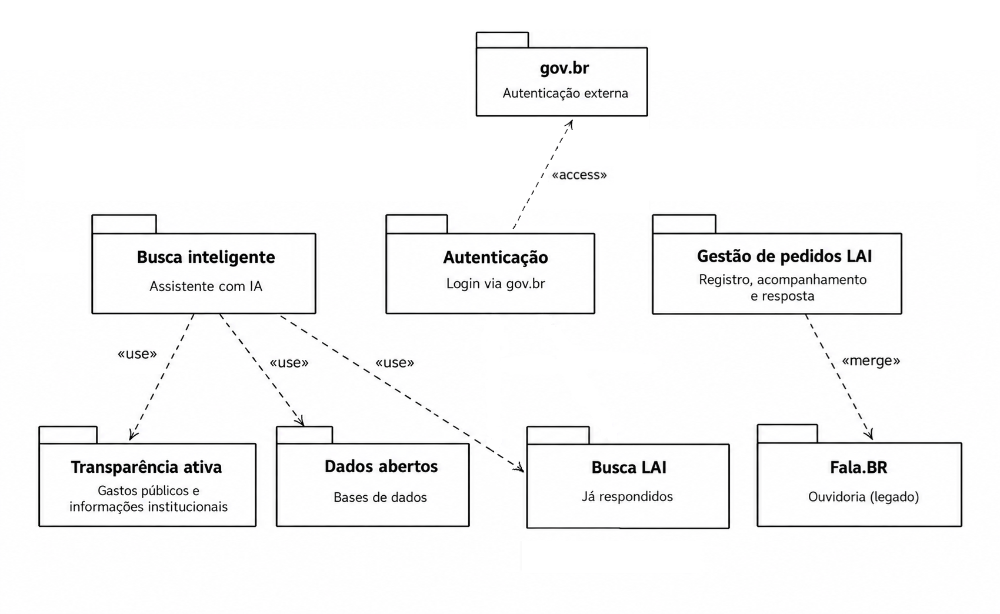

*Figura 1 — Diagrama de Pacotes do Informa.BR*

Autor: Pedro Augusto Ribeiro Faitarone Bessa

### Referencias

- [Diagrama de Pacotes - Slides da professora](https://drive.google.com/file/d/17TPUNv5Pllzhx23HIpZ0aJnU9hAJ9Ln9/view)
- [Diagrama de Pacotes - UML-Diagrams](https://www.uml-diagrams.org/package-diagrams-overview.html)

### Processo de elaboração do diagrama de pacotes — Fábio

#### 1. Levantamento e reconhecimento do sistema
- Acesso à URL do sistema (`https://informabr.cgu.gov.br/`) para identificar a aplicação.
- Pesquisa complementar em fontes oficiais (CGU, gov.br) e notícias institucionais para entender melhor o funcionamento do sistema, seu propósito (unificar buscas de transparência), o mecanismo de autenticação exigido, e quais plataformas ele consome ou substitui.
- Consolidação dos achados em uma lista de componentes funcionais do sistema (ex: motor de busca com IA, módulo de registro de pedidos LAI, autenticação gov.br, fontes de dados como Portal da Transparência, Dados Abertos e Fala.BR).

#### 2. Classificação dos componentes em camadas arquiteturais
- Cada componente identificado foi analisado quanto ao seu papel no fluxo de dados e decisão, e enquadrado em uma das três camadas:
  - **Superior - Identidade e governança**: serviços de apoio os componentes consomem, mas que não fazem parte do negócio central (ex: autenticação). O acesso ao Informa.BR é obrigatoriamente mediado pelo **gov.br**, plataforma federal de identidade digital. 

  - **Intermediária - Interface**: componentes que funcionam juntamente com o fluxo principal e concentram a lógica de negócio (ex: portal web, motor de busca, módulo de pedidos). O núcleo do sistema é o **Portal Informa.BR**, que atua como ponto único de entrada, orquestrando duas funções centrais:
    - O **Motor de Busca IA**, responsável por interpretar solicitações e varrer as fontes oficiais para apresentar respostas já existentes ao cidadão;
    - O **Módulo de Pedidos LAI**, acionado quando a busca não satisfaz a demanda, permitindo o registro formal de um pedido de acesso à informação.

  - **Inferior**: fontes de dados, repositórios e sistemas que fornecem ou armazenam informação.
    - Aqui ficam os repositórios que o Informa.BR unifica, o **Portal da Transparência** (despesas e contratos), o **Portal Brasileiro de Dados Abertos**, os **sites setoriais dos órgãos** e o **Fala.BR**.

Esse enquadramento segue o princípio de que dependências fluem predominantemente de cima para baixo (camadas superiores/intermediárias dependem das inferiores).


#### 3. Definição das relações de dependência
- Para cada par de componentes com relação funcional, foi definido:
  - **Direção da seta**: de quem depende para quem é dependido.
  - **Estereótipo semântico**: `<<use>>` para uso funcional direto (ex: portal usa o motor de busca), `<<access>>` para consulta/leitura de dados (ex: motor de busca acessa repositórios), `<<merge>>` para fusão/incorporação de fluxo com um sistema já existente (ex: módulo de pedidos se funde ao Fala.BR).
- Foi identificado o único caso de dependência "ascendente" (de uma camada inferior para uma superior), o que exigiu o uso da notação especial de seta para cima.

#### 4. Construção dos blocos de pacote
Cada pacote foi escrito no formato onde:
  - O **título** é o nome do componente/sistema.
  - O **subtítulo** descreve sua função específica dentro da arquitetura.

#### 5. Validação visual
- O código foi revisado e pode ser validado em um renderizador PlantUML ```editor.plantuml.com```  para confirmar que:
  - As três camadas aparecem visualmente separadas (superior, intermediária, inferior).
  - Os pacotes de cada camada estão alinhados horizontalmente.
  - As setas e estereótipos refletem corretamente a direção e a natureza de cada dependência.

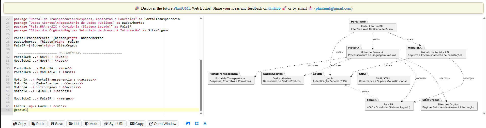
Print tirada dia 17/09/2026 do site [printuml.com](https://editor.plantuml.com/)

#### Diagrama final

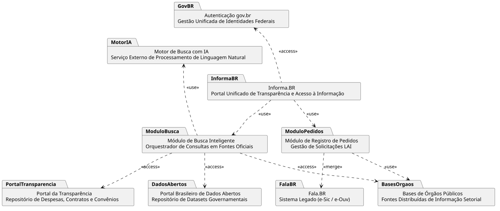
<a href="Base/Relatórios/ExtrasSubEquipe_02/Diagrama_de_Pacotes_F.svg" target="_blank" rel="noopener noreferrer">Clique aqui para acessar o diagrama</a>

### Referencias

- [Diagrama de Pacotes - Site da professora](https://sites.google.com/view/unb-fcte-arqdsw/m%C3%B3dulos/m%C3%B3dulo-modelagem?authuser=0)
- [Diagrama de Pacotes - Slides da professora](https://drive.google.com/file/d/17TPUNv5Pllzhx23HIpZ0aJnU9hAJ9Ln9/view)
- [Diagrama de Pacotes - UML-Diagrams](https://www.uml-diagrams.org/package-diagrams-overview.html)

### Processo de elaboração do Diagrama de Pacotes (Visão Arquitetural) — Lorena

#### 1. Levantamento e definição do recorte arquitetural
- Optou-se por olhar o Informa.BR sob a ótica de uma arquitetura full-stack, separando o sistema em camadas técnicas clássicas de desenvolvimento web, o que dá uma segunda perspectiva complementar ao modelo estático do grupo.
- Pesquisa sobre os padrões arquiteturais mais comuns em portais governamentais (separação Front-end/Back-end/Persistência) para embasar a escolha das camadas antes de iniciar a modelagem em PlantUML.

#### 2. Primeira versão do diagrama (v1) — Arquitetura Client-Server genérica
- A primeira iteração buscou apenas validar a viabilidade de representar o sistema em três blocos macro, sem ainda incorporar a nomenclatura específica do domínio do Informa.BR:
  - **Front-end (Interface)**: agrupando `UI Components`, `State Management` e `Client HTTP/API Consumer`;
  - **Back-end (API e Serviços)**: agrupando `Controllers`, `Autenticação` e `Regras de Negócio`;
  - **Persistência (Banco de Dados)**: agrupando `PostgreSQL/MongoDB` e `Repositórios/ORM`.
- As dependências entre os três blocos foram desenhadas de forma simples, apenas com as legendas "requisições HTTP/REST" e "consultas/persistência", sem estereótipos UML formais.

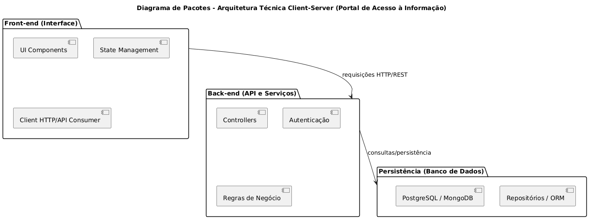
*Figura — Diagrama de Pacotes, versão 1 (arquitetura client-server genérica).*

#### 3. Refinamento da estrutura de pacotes e nomenclatura (versão intermediária)
- A partir da crítica da v1 — genérica demais e pouco aderente ao domínio do Informa.BR — os pacotes foram renomeados e reorganizados para refletir os componentes reais do sistema:
  - **Front-end Web**: `Módulo de Acessibilidade` e `Portal Informa.BR (GUI)`;
  - **Serviços de Aplicação (Back-end)**: `API Gateway`, `Serviço de Pedidos LAI`, `Serviço de Busca/BuscaLAI` e `Módulo de Autenticação`;
  - **Domínio de Negócio**: `Gestão de Manifestações` e `Motor de Prazos LAI`, isolando as regras de negócio da camada de dados;
  - **Camada de Dados**: `Banco de Dados (Transacional)` e `Índice de Notícias e FAQ`;
  - **Serviços Externos Governamentais**: `Sistemas dos Órgãos Públicos` e `gov.br (Identidade Digital)`.
- Nessa etapa as setas de dependência já passaram a ligar pacotes específicos (ex: API Gateway → Serviço de Pedidos LAI → Gestão de Manifestações → Motor de Prazos LAI → Sistemas dos Órgãos Públicos), mas ainda sem os estereótipos `<<use>>`/`<<access>>` nem as anotações explicativas.

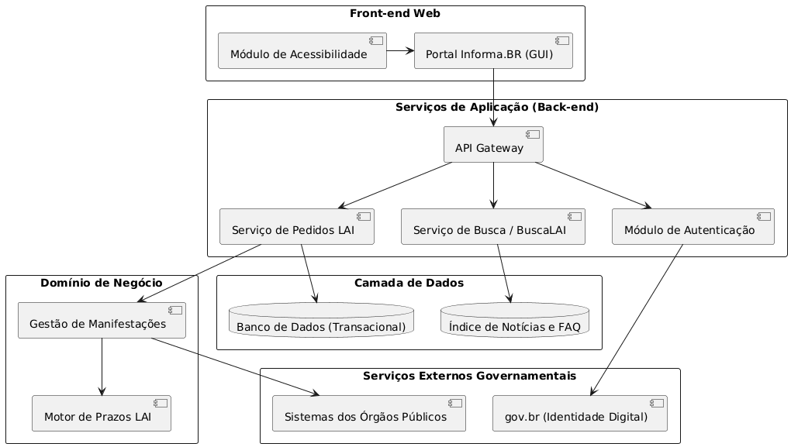
*Figura — Diagrama de Pacotes, versão intermediária (nomenclatura e pacotes já alinhados ao domínio do Informa.BR).*

#### 4. Formalização das relações em notação UML (versão final)
- Cada pacote da versão intermediária recebeu um estereótipo de camada (`«frontend»`, `«app»`, `«domain»`, `«data»`, `«external»`), tornando explícito o papel arquitetural de cada bloco.
- As dependências entre pacotes foram tipadas com `<<use>>` e `<<access>>`, refletindo como o front-end consome os serviços de back-end (via **API Gateway**) e como o **Módulo de Autenticação** depende do protocolo OAuth 2.0/OpenID Connect do **gov.br**.
- Foi adicionada uma nota explicativa junto ao API Gateway, esclarecendo seu papel como ponto único de entrada (roteamento, rate limiting e validação de contrato REST), e rótulos nas arestas (ex: "requisições HTTP/REST", "calcula prazo legal", "encaminha demanda") para deixar o fluxo de dependências autoexplicativo.

#### 5. Validação visual
- O código PlantUML de cada versão foi revisado em um renderizador (`editor.plantuml.com`) a cada iteração, conferindo se:
  - As cinco camadas (front-end, aplicação, domínio, dados, externos) permaneciam visualmente separadas e coerentes com a legenda de estereótipos;
  - As setas de dependência apontavam na direção correta (de quem consome para quem é consumido);
  - As anotações e rótulos não sobrepunham os pacotes, não prejudicando a leitura do diagrama final.

#### Diagrama final

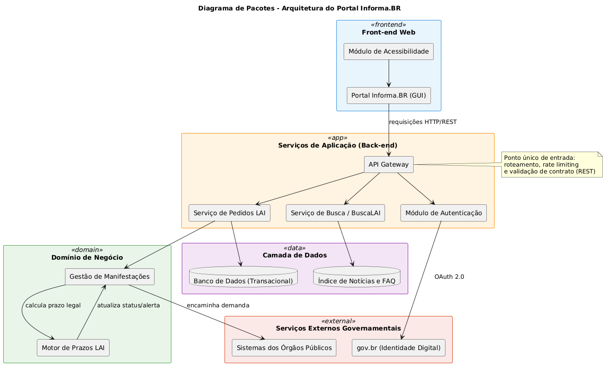
*Figura — Diagrama de Pacotes (Visão Arquitetural) do Informa.BR, versão final.*

Autor: Lorena Ribeiro Martins

### Referencias

- [Diagrama de Pacotes - Site da professora](https://sites.google.com/view/unb-fcte-arqdsw/m%C3%B3dulos/m%C3%B3dulo-modelagem?authuser=0)
- [Diagrama de Pacotes - Slides da professora](https://drive.google.com/file/d/17TPUNv5Pllzhx23HIpZ0aJnU9hAJ9Ln9/view)
- [Diagrama de Pacotes - UML-Diagrams](https://www.uml-diagrams.org/package-diagrams-overview.html)

### Decisão do Subgrupo — Diagrama de Pacotes Selecionado

Após a elaboração individual das propostas de Diagrama de Pacotes pelos integrantes (Pedro Augusto, Fábio Alessandro e Lorena Ribeiro), o subgrupo reuniu-se remotamente no dia 17/09/2026 para apresentar, comparar e deliberar sobre os modelos desenvolvidos, visando eleger a versão oficial que melhor representa a arquitetura do **Informa.BR**.

#### 1. Deliberação e Consenso da Equipe
A decisão foi tomada de forma unânime pelos três membros:
- **Diagrama Escolhido:** O **Diagrama de Pacotes (Visão Arquitetural)** elaborado pela integrante **Lorena Ribeiro Martins**.
- **Manutenção dos Demais Diagramas:** Os modelos elaborados por Pedro Augusto e Fábio Alessandro foram integralmente preservados no documento para assegurar a rastreabilidade de requisitos, evidenciar as diferentes perspectivas técnicas exploradas e documentar o processo colaborativo de modelagem.

#### 2. Justificativas da Escolha
A preferência pelo diagrama da Lorena fundamentou-se nos seguintes pontos debatidos durante a reunião:
1. **Abordagem Arquitetural em Camadas (Full-Stack):** O modelo adota uma organização arquitetural clássica e robusta dividida em cinco camadas nítidas (`«frontend»`, `«app»`, `«domain»`, `«data»` e `«external»`), permitindo compreender com exatidão a separação de responsabilidades e os fluxos de comunicação entre interface, serviços de aplicação e repositórios.
2. **Abrangência e Riqueza de Componentes:** Conforme destacado por Pedro na reunião, o diagrama abrangeu de maneira minuciosa as unidades funcionais críticas do portal — incluindo o API Gateway (com controle de tráfego e rate limiting), motor de prazos da LAI, gestão de manifestações e integração federada com o gov.br.
3. **Evolução Iterativa Documentada:** O modelo destacou-se pela transparência metodológica, demonstrando uma evolução clara desde uma arquitetura cliente-servidor genérica (v1), passando pelo refinamento de domínio (versão intermediária), até a formalização rigorosa com estereótipos UML (`<<use>>`, `<<access>>`) e notas explicativas.

#### 3. Rastreabilidade
- **Reunião de Deliberação (Reunião 02):** Realizada em 17/09/2026.
- **Participantes:** Pedro Augusto Ribeiro Faitarone Bessa, Fábio Alessandro Santos Vieira e Lorena Ribeiro Martins.
- **Ata da Reunião:** [Ata da Reunião 02 — Deliberação dos Modelos](Base/Relatórios/ExtrasSubEquipe_02/Ata_Reuniao_02.md)
- **Gravação da Reunião:**
<video src="Base/Relatórios/ExtrasSubEquipe_02/Gravacao_Reuniao_02.mp4" controls width="100%"></video>

#

### FOCO_02: Modelagem Dinâmica

Entrega Mínima: um modelo dinâmico, na notação UML.
Mira-se no MM no FOCO, com a entrega mínima.

### Participantes no Foco_02

|Nome do Membro | Contribuição |
| --- | --- |
| Pedro Augusto Ribeiro Faitarone Bessa | Elaboração do diagrama de atividades do fluxo de pedido de acesso a informação (LAI) |
| Fábio Alessandro Santos Vieira | Elaboração do foco_02 (Modelagem Dinâmica do diagrama de atividades) |
| Lorena Ribeiro Martins | Elaboração do processo e Diagrama de Atividades |

### Metodologia do Foco_02

Na mesma reunião mencionada no Foco_01, também foi definido como seria a divisão de trabalho do Foco_02, assim como qual foi o diagrama utilizada para a construção do nosso modelo dinâmico. E com base em nossas discussões e o conteúdo apresentado em sala o diagrama escolhido foi o diagrama de atividades. Aqui iremos utilizar a mesma motodologia do foco_01, cada um vai fazer o seu diagrama, para termos pontos de vistas diferentes, e posteriormente vamos nos reunir para discutir a respeito.

Ata da Reunião:
[Ata da Reunião](Base/Relatórios/ExtrasSubEquipe_02/Ata_Reuniao_01.md)

Gravação da Reunião:
<video src="Base/Relatórios/ExtrasSubEquipe_02/Gravacao_Reuniao_01.mp4" controls width="100%"></video>

### Modelo Dinâmico

### Diagrama de Atividades

### Processo de elaboração do diagrama de atividades — Fábio

#### 1. Levantamento e reconhecimento do sistema

- Acesso à URL do sistema (`https://informabr.cgu.gov.br/`) para identificar a aplicação

- Pesquisa complementar em fontes oficiais (CGU, gov.br) e notícias institucionais para entender o funcionamento do sistema.

- Consolidação dos achados em uma lista de atividades e atores do processo (ex: autenticação via gov.br, consulta em linguagem natural, varredura por IA, registro de pedido LAI, análise pelo órgão responsável, recurso à Ouvidoria da CGU).

#### 2. Identificação dos atores e definição das partições (swimlanes)
- Cada ator identificado foi analisado quanto ao seu papel no processo e enquadrado em uma partição (swimlane), seguindo o princípio de que cada raia representa um ator de negócio distinto:
  - **Cidadão**: pessoa física ou jurídica que inicia a consulta e, se necessário, registra o pedido de acesso.
  - **gov.br** `<<external>>`: provedor federal de identidade digital. Foi isolado com o estereótipo `<<external>>` por ficar fora do domínio de negócio da CGU — a autenticação é obrigatória, mas não é executada nem controlada pelo Informa.BR.
  - **Informa.BR (Plataforma)**: núcleo do sistema, que concentra a lógica de negócio e orquestra duas funções centrais:
    - a busca por **Inteligência Artificial**, que varre as fontes oficiais em busca de respostas já existentes;
    - o **registro e encaminhamento do pedido de acesso à informação (LAI)**, acionado quando a busca não satisfaz a demanda do cidadão.
  - **Órgão Público Responsável**: unidade da Administração Pública federal detentora da informação, responsável por analisar e responder ao pedido.
  - **CGU (Ouvidoria)**: instância recursal acionada quando o cidadão contesta um indeferimento.

#### 3. Definição do fluxo de controle, decisões e guardas
- Para cada par de atividades com relação de sequência, foi definido:
  - **Direção da aresta**: qual atividade antecede e qual sucede, respeitando a ordem de leitura do diagrama.
  - **Guarda da decisão**: toda vez que o processo se divide (autenticação válida? informação encontrada?...), a aresta correspondente recebeu a guarda `[sim]`/`[não]`, notação que só permite a passagem do fluxo quando a condição associada é avaliada como verdadeira.
  - **Fluxo de objeto**: as informações que trafegam entre atores (a solicitação do cidadão, o pedido de acesso, a resposta do órgão) foram modeladas como nós de objeto `<<object>>`, ligados por arestas tracejadas, para diferenciá-las do fluxo de controle comum.

#### 4. Construção dos nós de atividade em PlantUML
Cada trecho do processo foi escrito no formato onde:
  - A **partição** (`|Nome|`) delimita o ator responsável pelas ações que seguem, podendo ser reaberta quantas vezes o fluxo retornar àquele ator.
  - A **ação** (`:Nome da Ação;`) descreve o passo executado, podendo receber um estereótipo (`<<object>>`, `<<acceptEvent>>`) quando representa um objeto de negócio ou um evento aguardado.
  - A **decisão** (`if (Condição?) then ([Guarda]) ... else ([Guarda]) ... endif`) formaliza cada bifurcação identificada na etapa anterior.
  - Os nós `start`/`stop` delimitam o início único e os múltiplos desfechos possíveis do processo.

#### 5. Validação visual
- O código foi revisado e pode ser validado em um renderizador PlantUML ```editor.plantuml.com``` para confirmar que:
  - As partições aparecem visualmente separadas e na ordem correta de atuação de cada ator.
  - As guardas `[sim]`/`[não]` estão associadas às arestas corretas em cada decisão.
  - Os nós de objeto e suas arestas tracejadas refletem corretamente o fluxo de dados entre os atores.
  - O ramo de concorrência e o ponto de interrupção (`kill`) se comportam como esperado, sem interferir no fluxo principal.

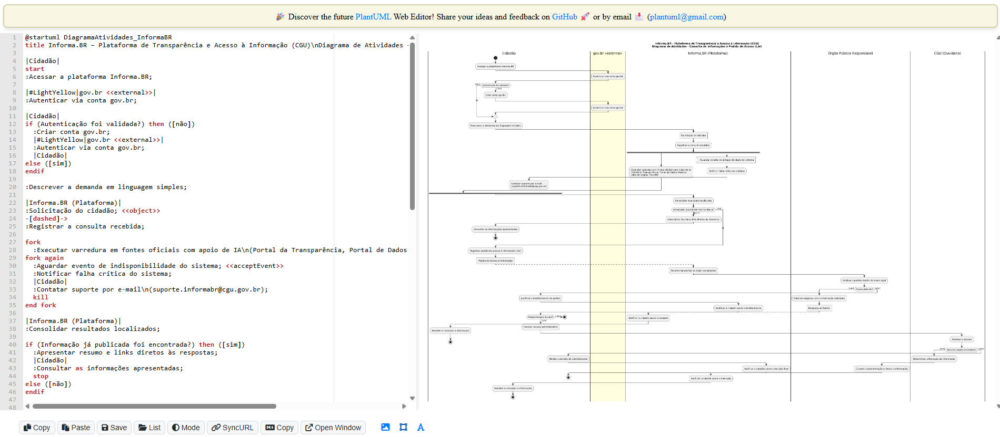
Print tirada em 17/09/2026 do site [editor.plantuml.com](https://editor.plantuml.com/)

#### Diagrama final

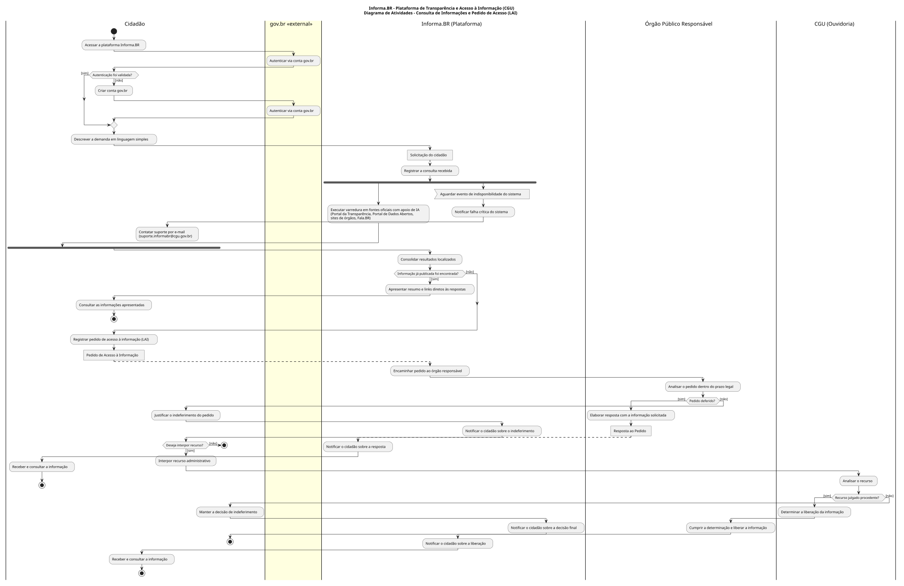
<a href="Base/Relatórios/ExtrasSubEquipe_02/Diagrama_de_Atividades_F.svg" target="_blank" rel="noopener noreferrer">Clique aqui para acessar o diagrama</a>

### Referencias

- [Diagrama de Atividades - Site da professora](https://sites.google.com/view/unb-fcte-arqdsw/m%C3%B3dulos/m%C3%B3dulo-modelagem?authuser=0)
- [Diagrama de Atividades - Slides da professora](https://drive.google.com/file/d/1riZ72ujREyYIaoIweNHOLGUftfvgC8qm/view)
- [Diagrama de Atividades - UML-Diagrams](https://www.uml-diagrams.org/activity-diagrams.html)

### Processo de elaboração do diagrama de atividades — Pedro Augusto

O Diagrama de Atividades foi desenvolvido considerando o fluxo de tratamento de um **pedido de acesso à informação (LAI)** no portal **Informa.BR**, buscando representar as ações realizadas por cada parte envolvida no processo, assim como os pontos de bifurcação e junção entre elas.

A construção do modelo seguiu as seguintes etapas:

**Levantamento de referências e definição do escopo**
Foi realizado um estudo do conteúdo da disciplina (aula de Modelagem UML Dinâmica — Profa. Milene Serrano), com foco na notação de diagramas de atividades com unidades organizacionais, nós de bifurcação (fork) e junção (join). A partir disso, foi definido para ser representado o fluxo de recebimento, encaminhamento e resposta a um pedido LAI, por ser um dos processos centrais do Informa.BR.

**Organização das unidades organizacionais**
Foram definidas três unidades organizacionais, representando os responsáveis por cada ação do processo:

- **Cidadão** — usuário que solicita e acompanha o pedido de acesso à informação.
- **Informa.BR** — sistema responsável por receber, encaminhar e notificar sobre o pedido.
- **Órgão responsável** — unidade pública encarregada de analisar o pedido recebido.

**Estrutura final do fluxo**
O processo se inicia com o nó inicial na unidade `Informa.BR`, com a ação `Receber pedido`. Em seguida, ocorre uma **bifurcação**: uma via segue para a unidade `Cidadão` (`Confirmar dados` → `Acompanhar pedido`), enquanto a outra permanece em `Informa.BR` (`Encaminhar pedido`), acionando a unidade `Órgão responsável` (`Analisar pedido`). As duas vias se recombinam em uma **junção**, seguindo para a ação `Notificar cidadão` (`Informa.BR`) até o nó final, encerrando o fluxo.

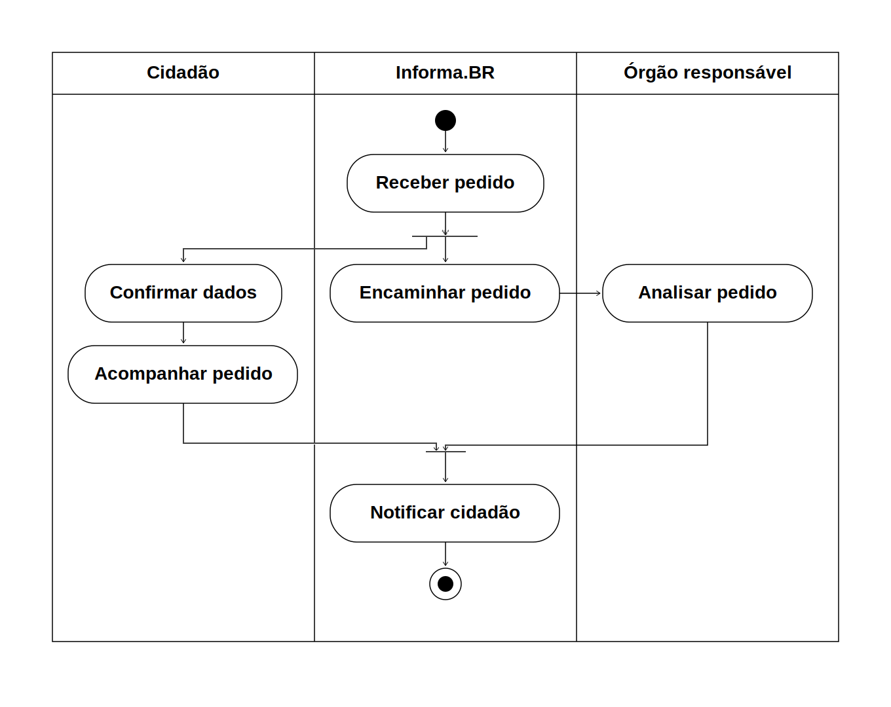

*Figura 2 — Diagrama de Atividades do processo de pedido LAI no Informa.BR, versão 1.0*

Autor: Pedro Augusto Ribeiro Faitarone Bessa

### Referencias

- [Diagrama de Pacotes - Slides da professora](https://drive.google.com/file/d/17TPUNv5Pllzhx23HIpZ0aJnU9hAJ9Ln9/view)
- [Diagrama de Pacotes - UML-Diagrams](https://www.uml-diagrams.org/package-diagrams-overview.html)

### Processo de elaboração do Diagrama de Atividades — Lorena

#### 1. Levantamento e definição do escopo
- Levantamento do fluxo de "Envio de Pedido de Informação" no Informa.BR como processo central a ser modelado, por concentrar tanto a lógica de negócio do sistema quanto a integração externa com o gov.br.
- Consolidação dos três atores envolvidos no processo — **Cidadão**, **Sistema (Informa.BR)** e **Serviço Externo (gov.br)** — cada um representado como uma raia (swimlane) distinta.

#### 2. Primeira versão do diagrama (v1) — fluxo básico de autenticação e persistência
- A primeira iteração modelou apenas o esqueleto do processo, sem ainda detalhar as regras de negócio de sigilo:
  - `Cidadão` preenche o formulário de solicitação;
  - o `Sistema Informa.BR` decide, por uma bifurcação simples (`Tipo de Pedido? Identificado/Anônimo`), se mantém o pedido como anônimo ou se aciona a autenticação;
  - quando identificado, o `Serviço Externo gov.br` executa o redirecionamento OAuth, autentica o usuário e valida as credenciais, retornando o resultado ao Informa.BR;
  - o fluxo se une em um nó de junção, segue para validação dos dados, persistência do pedido e exibição do número de protocolo ao cidadão.
- Nessa versão ainda não havia tratamento de exceção para falha de login, nem diferenciação de como o dado de identidade era tratado internamente.

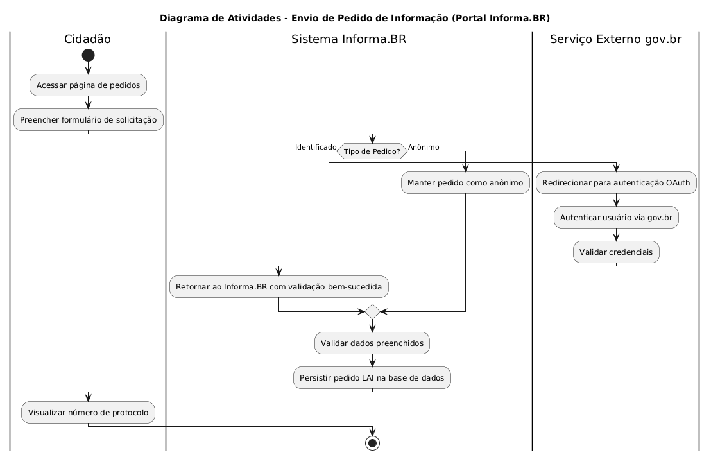
*Figura — Diagrama de Atividades, versão 1 (fluxo básico de autenticação e persistência).*

#### 3. Refinamento do fluxo e tratamento de sigilo (versão intermediária)
- A bifurcação inicial foi reposicionada para o momento em que o cidadão define, explicitamente, se o pedido será **Anônimo** ou **Identificado**, tornando essa decisão de negócio (e não apenas técnica) o ponto de partida da ramificação.
- Foi adicionado o passo `Solicita definição de sigilo`, no qual o Sistema pede formalmente ao cidadão essa escolha antes de decidir o caminho do fluxo.
- Para o caminho anônimo, foi criado o passo `Configura pedido sem dados do remetente`, evitando que a identidade do cidadão seja vinculada ao pedido nesse cenário.
- Foi incluído, pela primeira vez, um tratamento de exceção para login malsucedido: a decisão `Login bem-sucedido? Sim/Não` passou a ter dois desfechos (erro de autenticação vs. vínculo de identidade ao rascunho do pedido), embora ainda de forma simplificada, encerrando o fluxo diretamente em caso de falha.

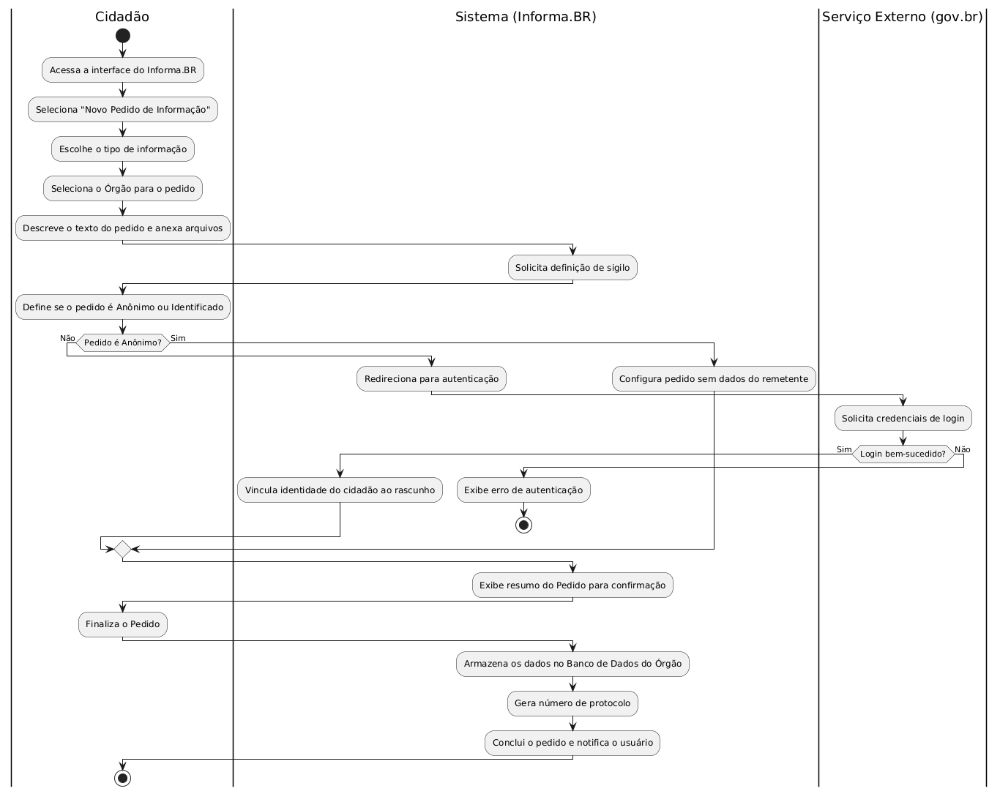
*Figura — Diagrama de Atividades, versão intermediária (com escolha explícita de sigilo e tratamento inicial de falha de login).*

#### 4. Definição das regras de negócio críticas (LAI e LGPD) — versão final
- **Escolha de identidade**: o fluxo final deixa explícito, por meio de uma nota, que a escolha de anonimato é apenas uma preferência de exibição perante o órgão respondente, já que a autenticação via gov.br continua sendo obrigatória em qualquer caso;
- **Tratamento de exceção de login**: o desvio condicional para falha de autenticação foi refinado para encerrar o fluxo de forma segura (`detach`), sem corromper a sessão do cidadão, em vez de simplesmente interromper o processo;
- **Diferenciação de perfis**: a ramificação `Pedido marcado como Anônimo?` passou a tratar de forma simétrica os dois cenários — ocultando a identidade do cidadão perante o órgão respondente em um caso, e vinculando-a ao pedido no outro — unindo-se novamente em um nó de junção antes da confirmação do pedido;
- **Pós-condições**: após a confirmação, o sistema executa três passos atômicos encadeados — armazenamento seguro dos dados no banco do órgão competente, geração automática do número de protocolo no padrão real observado no sistema (ex: `50001.189059/2026-43`) e cálculo do prazo legal de resposta (20 dias corridos, com margem de prorrogação de +10 dias) — disparando em seguida a notificação de conclusão ao cidadão.

#### 5. Refinamento visual e validação de sintaxe
- Aplicação de paleta de cores (`skinparam`) para diferenciar visualmente os estados de sucesso (verde/azul) do estado de erro de autenticação (vermelho), facilitando a leitura rápida do fluxo.
- Inclusão de notas explicativas diretamente ligadas às atividades críticas (escolha de sigilo e geração de protocolo), baseadas em validações empíricas do portal real.
- Revisão final de sintaxe em um renderizador PlantUML (`editor.plantuml.com`) a cada versão, garantindo que as raias, decisões e o nó de junção final renderizassem sem alertas de compilação.

#### Diagrama final

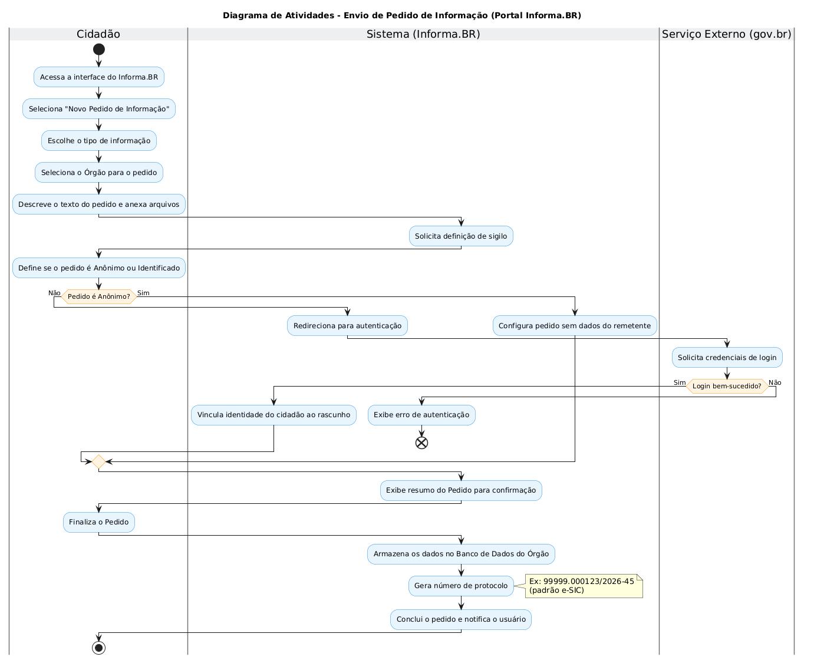
*Figura — Diagrama de Atividades do fluxo de Envio de Pedido de Informação, versão final.*

Autor: Lorena Ribeiro Martins

### Referencias

- [Diagrama de Atividades - Site da professora](https://sites.google.com/view/unb-fcte-arqdsw/m%C3%B3dulos/m%C3%B3dulo-modelagem?authuser=0)
- [Diagrama de Atividades - Slides da professora](https://drive.google.com/file/d/1riZ72ujREyYIaoIweNHOLGUftfvgC8qm/view)
- [Diagrama de Atividades - UML-Diagrams](https://www.uml-diagrams.org/activity-diagrams.html)

### Decisão do Subgrupo — Diagrama de Atividades Selecionado

Dando continuidade à metodologia adotada pelo subgrupo, os integrantes reuniram-se no dia 17/09/2026 para avaliar os Diagramas de Atividades produzidos individualmente e selecionar o modelo oficial de representação dinâmica do sistema **Informa.BR**.

#### 1. Deliberação e Consenso da Equipe
A equipe debateu sobre a abrangência de escopo e a complexidade de cada proposta:
- **Diagrama Escolhido:** O **Diagrama de Atividades (Fluxo de Envio de Pedido de Informação)** elaborado pela integrante **Lorena Ribeiro Martins**.
- **Manutenção dos Demais Diagramas:** Os modelos propostos por Fábio Alessandro e Pedro Augusto foram mantidos no artefato para registrar os diferentes recortes de escopo analisados (desde a visão macro sistêmica até o fluxo conciso de tratamento).

#### 2. Justificativas da Escolha
A escolha unânime pelo modelo da Lorena baseou-se nos seguintes critérios:
1. **Equilíbrio Ideal de Escopo (Nível Intermediário):** Na discussão da reunião, constatou-se que o diagrama do Fábio abrangeu um fluxo excessivamente macro (tentando englobar o comportamento do portal inteiro, o que elevou drasticamente a escala e a complexidade visual do artefato), enquanto o modelo do Pedro adotou um fluxo bastante sintético e direto. A versão da Lorena representou o ponto de equilíbrio ideal ("meio-termo"), aprofundando-se com precisão e clareza no processo mais nobre e frequente do portal: o registro e encaminhamento de pedidos via LAI.
2. **Aderência às Regras de Negócio e Legislação (LAI e LGPD):** O diagrama contemplou nuances essenciais da legislação, tais como a diferenciação entre a solicitação anônima e identificada (evidenciando que a autenticação gov.br é mandatória por segurança, mas que os dados do cidadão podem ser preservados perante o órgão), além do cálculo dos prazos regimentais (20 dias corridos + 10 dias de prorrogação) e geração de protocolo no formato real.
3. **Tratamento de Exceções e Qualidade Visual:** A modelagem contemplou o tratamento formal de falha de autenticação (desvio condicional com terminação segura `detach`), nós de junção coerentes e estilização semântica de cores, tornando a leitura do fluxo dinâmica e intuitiva.
4. **Construção Incremental:** Assim como no modelo estático, a apresentação da evolução em três etapas (v1 básica, intermediária com sigilo e versão final refinada) enriqueceu o rigor metodológico da entrega.

#### 3. Rastreabilidade
- **Reunião de Deliberação (Reunião 02):** Realizada em 17/09/2026.
- **Participantes:** Pedro Augusto Ribeiro Faitarone Bessa, Fábio Alessandro Santos Vieira e Lorena Ribeiro Martins.
- **Ata da Reunião:** [Ata da Reunião 02 — Deliberação dos Modelos](Base/Relatórios/ExtrasSubEquipe_02/Ata_Reuniao_02.md)
- **Gravação da Reunião:**
<video src="Base/Relatórios/ExtrasSubEquipe_02/Gravacao_Reuniao_02.mp4" controls width="100%"></video>

### FOCO_03: IA Generativa

Entrega Mínima: pontos de vista de cada membro da equipe sobre as lições aprendidas e uso da IA Generativa.
TODOS DEVEM PARTICIPAR!

### Participantes no Foco_03
| Nome do Membro | Lições Aprendidas | Uso da IA Generativa (SENSO CRÍTICO) |
| --- | --- | --- |
| Pedro Augusto Ribeiro Faitarone Bessa | Compreendi melhor sobre como seria feita a divisão dos pacotes de um site, a partir do modelo inicial gerado pela IA, que foi esse modelo: 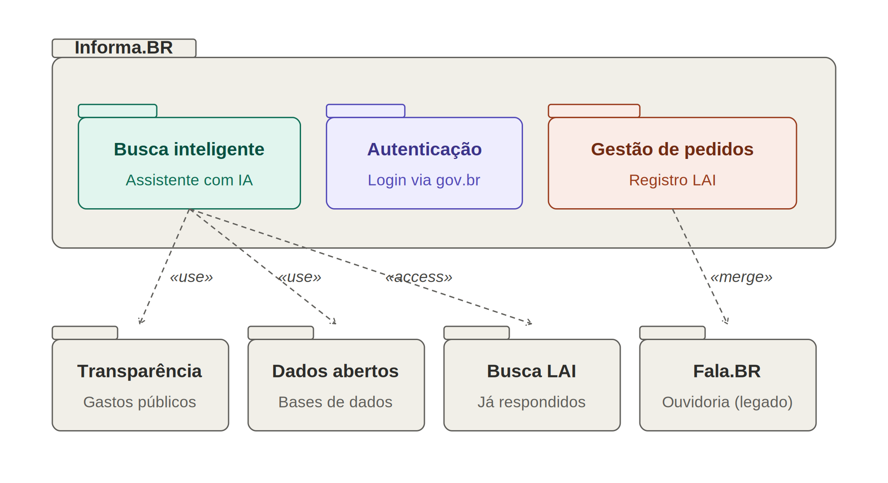 que posteriormente foi usado como base para a elaboração real do diagrama de pacotes. | Eu acredito que apesar da IA dar uma boa base as vezes, e ter capacidade muito boa de esclarecer as dúvidas, já que você pode perguntar qualquer coisa a qualquer momento, é notória a limitação dela quando se trata de fazer a análise de um site inteiro, e depois fazer um diagrama. Acaba que algumas das relações por exemplo, no caso do modelo estático, acabando por estarem erradas, e mesmo após realizar algumas tentativas de alinhar a IA com o que eu estava dizendo, ainda não foi possível corrigir alguns desses erros. |
| Fábio Alessandro Santos Vieira | A principal lição aprendida é que a IA ainda tem defeitos para conseguir fazer uma analise profunda sobre o que deve ser feito, não consegui apenas jogar o link do plano de ensino da professora e entender perfeitamente o que deveria ser feito para a entrega 02, com isso, tive que parar alguns minutos para ir no site da professora, ver o plano de ensino, buscar o github e entender perfeitamente o que deve ser entregue com atenção, não podendo confiar ainda na IA para essa analise inicial de um trabalho, mesmo ela sendo util para tirar duvidas e fazer algumas coisas mais simples. | Uso da IA para entender o que deve ser entregue: https://share.gemini.google/WHCVhygmseZ9 Porém, utilizando os slides da propria professora conseguir montar uma linha de raciocinio para estudos e conseguir saber um minimo de conhecimento para conseguir fazer e analisar criticamente o trabalho https://share.gemini.google/Rq6SCbZQoBXg |
| Fábio Alessandro Santos Vieira | Pelo minha percepção, a IA ainda alucina bastante, se você não fizer um ótimo prompt, utilizar referencias externas e fazer uma analise critica, é muito provavel que ela gere um resultado com bastantes erros, algo que um ser humano com pensamento critico por tras ainda é necessario para validar o que ela entregou. | Após ter uma conhecimento basico sobre o que deveria fazer nessa segunda entrega, usei a IA para poder me ajudar a fazer os diagramas de atividade o diagrama de pacote, com isso, acabei conseguindo uma base que considero algo na média (5/10) para que eu conseguisse fazer e finalizar o trabalho https://claude.ai/share/bb06c69c-cbae-4c8d-b754-2c47bc6da006 |
| Lorena Ribeiro Martins | A principal lição foi entender a IA como uma ferramenta de aceleração para sintaxe visual. Aprendi que é possível traduzir rapidamente lógicas de arquitetura de software (Front, Back, DB) e regras de negócio em código PlantUML, desde que o escopo e as condicionais sejam rigorosamente definidos nos prompts. | A IA é extremamente útil para gerar o código visual e formatar documentação em Markdown, mas o esforço de engenharia de requisitos é insubstituível, e confiar cegamente na geração resulta em fluxos ilógicos — utilizei a IA como apoio para estruturar os diagramas, ela me gerou a primeira versão dos diagramas bem genérica e eu fui refinando até encontrar uma modelagem que sinto que representou bem o que eu desejava mostrar. Além de me auxiliar com a geração de códigos para o PlantUML. |

#
## Versionamentos

| Nome do Membro | Contribuição | Data |
| --- | --- | --- |
| Pedro Augusto Ribeiro Faitarone Bessa  |  1. Elaboração do Diagrama de Pacotes & Ponto de Vista sobre o Uso de IA Generativa | 17/09/2026 |
| Fábio Alessandro Santos Vieira  |  1. Elaboração do Diagrama de Pacotes | 17/09/2026 |
| Fábio Alessandro Santos Vieira  |  2. Elaboração do Diagrama de Atividades | 17/09/2026 |
| Fábio Alessandro Santos Vieira  |  3. Elaboração das lições aprendidas e uso da IA Generativa | 17/09/2026 |
| Pedro Augusto Ribeiro Faitarone Bessa  |  1. Elaboração do Diagrama de Atividades | 17/09/2026 |
| Lorena Ribeiro Martins | Elaboração do Diagrama de Pacotes (Visão Arquitetural) | 17/09/2026 |
| Lorena Ribeiro Martins | Elaboração do Diagrama de Atividades | 17/09/2026 |
| Lorena Ribeiro Martins | Elaboração das lições aprendidas e ponto de vista sobre IA Generativa | 17/09/2026 |
| Pedro Augusto Ribeiro Faitarone Bessa | Adicionando vídeo e Ata de reunião (Reunião 01 e 02) | 17/09/2026 |
| Lorena Ribeiro Martins | Atualizando participação e documentação | 17/09/2026 |
| Fábio Alessandro Santos Vieira | Inclusão das deliberações, decisões da equipe e rastreabilidade da Reunião 02 (Ata e Gravação) | 17/09/2026 |
