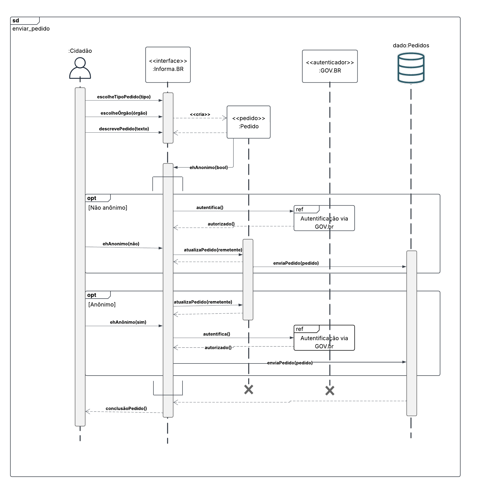
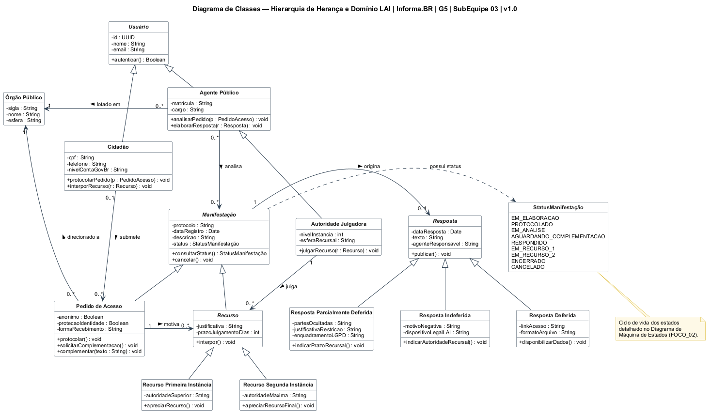

# Governo Eletrônico

**Código da Disciplina**: FGA0208 
**Número do Grupo**: 05 
**Entrega**: 02 

## Alunos

<!-- TODO (equipe): completar a tabela com Tiago (SubEquipe 01) e os integrantes da SubEquipe 03 (nomes completos e matrículas). -->

| Matrícula | Aluno |
| --- | --- |
| 23/1029270 | Pedro Henrique Martins Silva |
| 24/1012329 | Luiz Henrique Pallavicini |

## Sobre

Este repositório contém os artefatos e o protótipo interativo desenvolvidos para a **Entrega 02** da disciplina **Arquitetura e Desenho de Software (FGA0208)**.

O projeto tem como objeto de estudo o portal **Informa.BR (informabr.cgu.gov.br)**, plataforma relacionada à Lei de Acesso à Informação (LAI), utilizada para gerenciamento e acompanhamento de solicitações de acesso à informação. A interface foi projetada seguindo uma estética de *data-dense civic terminal*.

A entrega contempla modelos estáticos e dinâmicos do sistema, aliados à materialização do fluxo através do frontend, englobando:

- **Diagrama de Componentes (Modelagem Estática):**
  Representa a organização dos principais componentes do sistema, suas responsabilidades e relacionamentos. O modelo desenvolvido considera a divisão entre Front-end Web, Back-end, Banco de Dados e o sistema de Acessibilidade.

- **Diagrama de Sequência (Modelagem Dinâmica):**
  Representa o fluxo de interação para realização de um pedido de acesso à informação, considerando as interações entre o cidadão, a interface do Informa.BR, e o armazenamento das informações.

- **Protótipo Interativo (Frontend):**
  Desenvolvimento do fluxo de navegação do usuário focado na criação de pedidos. O componente principal (`src/NovoPedido.tsx`) exibe um formulário *stepper* em tela cheia. Para simplificar a experiência do usuário, o diagrama de sequência animado que ficava na lateral foi descartado da interface final.

Referências utilizadas:
- Documentação UML - Component Diagrams: https://www.uml-diagrams.org/component.html
- Documentação UML - Sequence Diagrams: https://www.uml-diagrams.org/sequence-diagrams.html
- Portal Informa.BR: https://informabr.cgu.gov.br

## Screenshots da Segunda Entrega

### Diagrama de Componentes

**Ficha Técnica - Componentes:**
* **Autores:** Pedro Henrique Martins Silva (Estrutura inicial v1.0) e Luiz Henrique Pallavicini (Refatoração para v1.1 ajustando regras UML).
* **Link Editável (Figma):** [Acessar Diagrama de Componentes v1.1](https://www.figma.com/make/jAnwuaCUnUyl42EucAvKer/diagrama-de-componentes-v1.1?t=AQkyZDaNwsZcXn1X-20&fullscreen=1)

---

### Diagrama de Sequência

**Ficha Técnica - Sequência:**
* **Autores:** Luiz Henrique Pallavicini (Rascunho Inicial v1.0) e Pedro Henrique Martins Silva (Modelagem Dinâmica).
* **Link Editável (Figma):** [Acessar Rascunho do Diagrama de Sequência](https://www.figma.com/make/Qe1S4LmGmd7aP9wgsaUF54/Rascunho-de-Diagrama?t=ba2uUdZsLMrTomvI-20&fullscreen=1)

---

### Diagrama de Classes (Herança) — SubEquipe 03

**Ficha Técnica - Classes (Herança):**
* **Autores:** SubEquipe 03 — Isaac Lucas, André João, Rivadalvio Joaquim e João Paulo Barros.
* **Fonte Editável (PlantUML):** [Diagrama_de_Classes_Heranca_V01.puml](https://github.com/UnBArqDsw2026-2-Turma02/2026.2-T02-_G5_ProjetoGovernoEletronico_Entrega_02/blob/SubEquipe03/docs/Base/Relat%C3%B3rios/ExtrasSubEquipe_03/Diagrama_de_Classes_Heranca_V01.puml)

---

### Diagrama de Estado — SubEquipe 03

**Ficha Técnica - Estado:**
* **Autores:** SubEquipe 03 — Isaac Lucas, André João, Rivadalvio Joaquim e João Paulo Barros.
* **Arquivo:** [Diagrama de Estado (JPEG)](https://github.com/UnBArqDsw2026-2-Turma02/2026.2-T02-_G5_ProjetoGovernoEletronico_Entrega_02/blob/SubEquipe03/docs/Base/Relat%C3%B3rios/ExtrasSubEquipe_03/Diagrama%20de%20Estado.jpeg)

## Há algo a ser executado?

( ) NÃO

(X) SIM

Diferente da etapa puramente de modelagem, esta entrega conta com um protótipo interativo frontend que pode ser executado para validação do formulário passo a passo de criação de pedidos.

## Informações Complementares e Contribuições

Para garantir a transparência da evolução do projeto, as seguintes participações diretas foram registradas nesta entrega:

* **Luiz Henrique Pallavicini:** Responsável pela análise crítica e evolução do *Diagrama de Componentes* (versão 1.1) e ideação primária do fluxo dinâmico (rascunho inicial). Contribuiu ativamente no refinamento da experiência do usuário e nas decisões de design do protótipo interativo (estética *civic terminal*).
* **Pedro Henrique Martins Silva:** Responsável pela diagramação estática original (v1.0) do *Diagrama de Componentes*, consolidação do *Diagrama de Sequência*, configuração do repositório/GitHub Pages, relatório de IA, e pelo desenvolvimento direto do protótipo interativo, com foco na simplificação do componente `src/NovoPedido.tsx` e implementação do formulário *stepper* em tela cheia.
