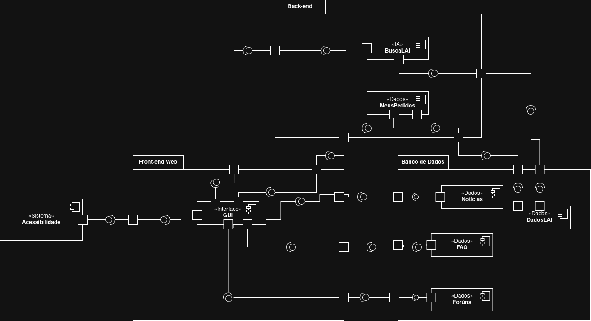

# Governo Eletrônico

**Código da Disciplina**: FGA0208 
**Número do Grupo**: 05 
**Entrega**: 02 

## Alunos

| Matrícula | Aluno |
| --- | --- |
| 23/1029270 | Pedro Henrique Martins Silva |
| xx/xxxxxx | xxxx xxxx |

## Sobre

Este repositório contém os artefatos desenvolvidos para a **Entrega 02** da disciplina **Arquitetura e Desenho de Software (FGA0208)**, com foco na modelagem de um sistema utilizando a notação UML.

O projeto tem como objeto de estudo o portal **Informa.BR (informabr.cgu.gov.br)**, plataforma relacionada à Lei de Acesso à Informação (LAI), utilizada para gerenciamento e acompanhamento de solicitações de acesso à informação.

A entrega contempla modelos estáticos e dinâmicos do sistema, buscando representar sua estrutura e comportamento por meio dos seguintes diagramas UML:

- **Diagrama de Componentes (Modelagem Estática):**
  Representa a organização dos principais componentes do sistema, suas responsabilidades e relacionamentos. O modelo desenvolvido considera a divisão entre Front-end Web, Back-end, Banco de Dados e o sistema de Acessibilidade, além dos componentes relacionados à interação com usuários, armazenamento de dados e funcionalidades específicas como BuscaLAI, FAQ, Notícias e Fóruns.

- **Diagrama de Sequência (Modelagem Dinâmica):**
  Representa o fluxo de interação para realização de um pedido de acesso à informação, considerando as interações entre o cidadão, a interface do Informa.BR, o processo de autenticação via GOV.BR, criação do pedido e armazenamento das informações.

A modelagem foi desenvolvida utilizando como referência a documentação oficial da UML e exemplos de diagramas produzidos em entregas anteriores da disciplina.

Referências utilizadas:

- Documentação UML - Component Diagrams:
  https://www.uml-diagrams.org/component.html

- Documentação UML - Sequence Diagrams:
  https://www.uml-diagrams.org/sequence-diagrams.html

- Portal Informa.BR:
  https://informabr.cgu.gov.br

## Screenshots da Segunda Entrega

### Diagrama de Componentes

O Diagrama de Componentes representa a organização estrutural do Informa.BR, considerando os principais módulos e relacionamentos entre as camadas do sistema.

---

### Diagrama de Sequência

O Diagrama de Sequência representa o fluxo de criação de um pedido de acesso à informação.

## Há algo a ser executado?

(X) NÃO

( ) SIM

Não há aplicação ou código executável associado aos artefatos desta entrega. O objetivo desta etapa é exclusivamente a elaboração e documentação dos modelos UML do sistema estudado.

## Informações Complementares

